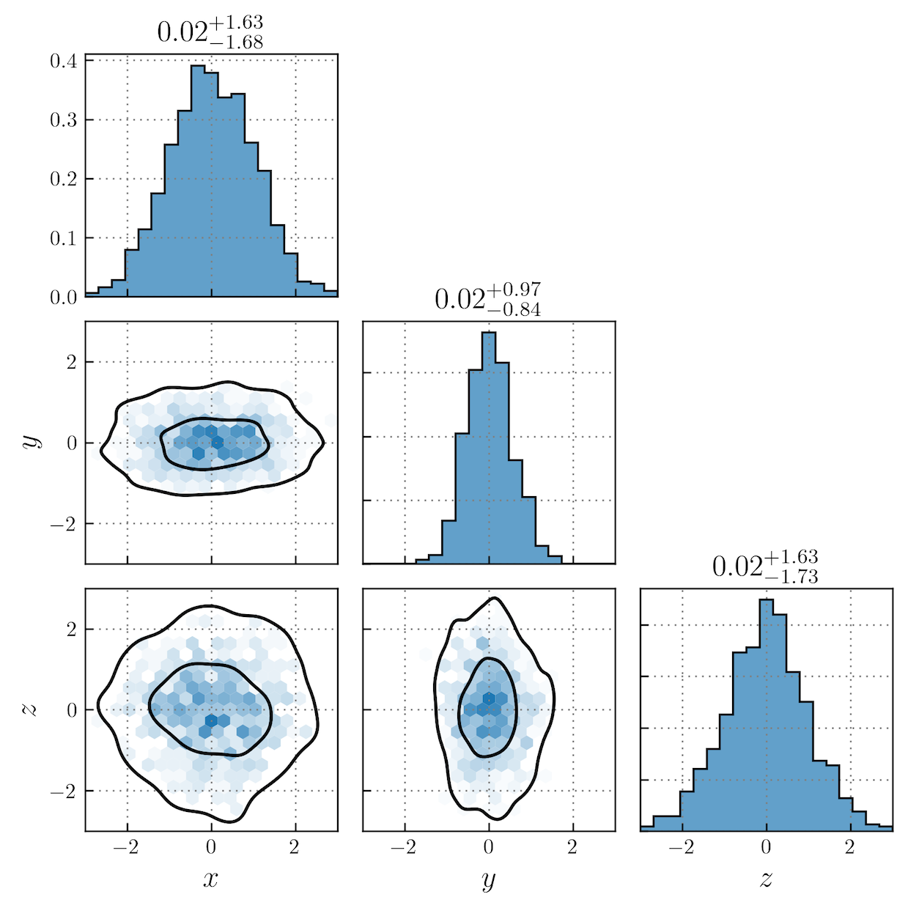

# makecorner

Code for generating publication-ready corner plots.

## Example

```python
import numpy as np
from makecorner import corner

# Generate some mock data
xs = np.random.normal(size=1000)
ys = np.random.normal(size=1000, scale = 0.54)
zs = np.random.normal(size=1000)

data = {
    'x':{'data': xs, 'plot_bounds':(-3, 3), 'label':r'$x$'},
    'y':{'data': ys, 'plot_bounds':(-3, 3), 'label':r'$y$'},
    'z':{'data': zs, 'plot_bounds':(-3, 3), 'label':r'$z$'}
}

# Create corner plot
corner(data, contour_levels=(0.5, 0.95))
```




